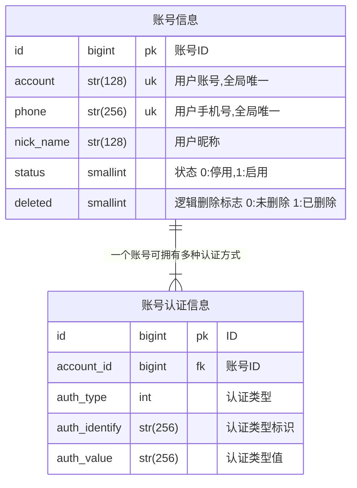

# OneAPI
> OneAPI是基于Python的Web框架:FastAPI开发的一个统一用户中心的服务。OneAPI作为平台方，旨在提供一套全局统一且通用的用户体系，帮助业务系统或应用减少开发相关的底层用户体系，并在业务形态上支持toB,toC,toBtoB,toBtoC的平台化服务。

# 账号
> 账号是OneAPI的基础数据，用户在多系统(※接入OneAPI的)之间，可通过账号信息来打通相关的业务数据
- 账户ID，手机号是唯一标识；其中，三方登录的时候，可通过手机号来关联到一个账号上

