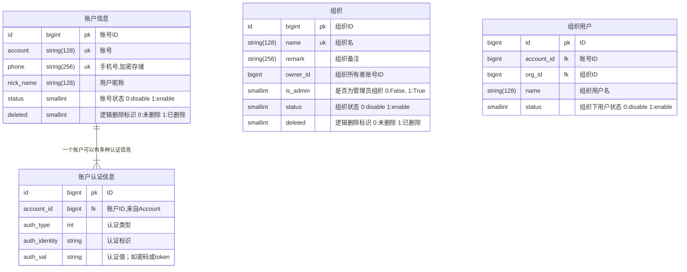

[toc]

# OneAPI
统一用户中心(One)的API服务

# 账号&组织

```mermaid
erDiagram
a["账户信息"]{
	id bigint pk "账号ID"
	account string(128) uk "账号"
	phone string(256) uk "手机号,加密存储"
	nick_name string(128) "用户昵称"
	status smallint "账号状态 0:disable 1:enable"
	deleted smallint "逻辑删除标识 0:未删除 1:已删除" 
}

b["账户认证信息"]{
	id bigint pk "ID"
	account_id bigint fk "账户ID,来自Account"
	auth_type int "认证类型"
	auth_identity string "认证标识"
	auth_val string "认证值；如密码或token"
}

c["组织"]{
	id bigint pk "组织ID"
	string(128) name uk "组织名"
	string(256) remark "组织备注"
	bigint owner_id "组织所有者账号ID"
	smallint is_admin "是否为管理员组织 0:False, 1:True"
	smallint status "组织状态 0:disable 1:enable"
	smallint deleted "逻辑删除标识 0:未删除 1:已删除" 
} 

d["组织用户"]{
	bigint id pk "ID"
	bigint account_id fk "账号ID"
	bigint org_id fk "组织ID"
	string(128) name "组织用户名"
	smallint status "组织下用户状态 0:disable 1:enable"	
}

a || -- |{ b : "一个账户可以有多种认证信息"
```
